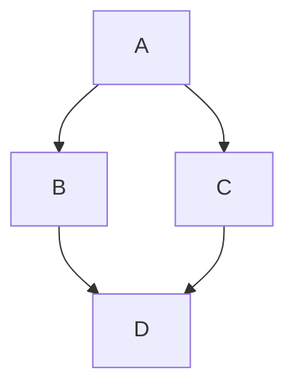

This page shows off the features available in this Mintlify docs site.

Its best to view the raw markdown source of this page on GitHub to see how things are written.

## Markdown

Best to look at [a general markdown guide](https://www.markdownguide.org/getting-started/) for this!

**bold**

*italic*

~~strikethrough~~

## Callouts

Mintlify provides several callout components:

<Note>
  General information and notes.
</Note>

<Info>
  Additional context or background info.
</Info>

<Tip>
  Helpful tips and tricks.
</Tip>

<Warning title="Caution">
  Watch out for potential issues.
</Warning>

<Danger title="Important">
  Critical information that requires attention.
</Danger>

<Success>
  Successful outcomes and confirmations.
</Success>

## Accordions

<Accordion title="Click to expand">
  Hidden content that can be revealed on demand.
</Accordion>

## Code blocks

```csharp
public sealed class GreeterSystem : EntitySystem
{
    public void GreetEveryone(string message)
    {
        Logger.Info(message);
    }
}
```

## LaTeX

Block LaTeX:

$$ \mu = \frac{1}{N} \sum_{i=0} x_i $$

Inline LaTeX: $ \LaTeX $

## Mermaid


