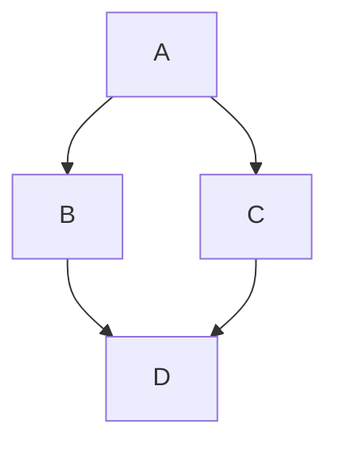
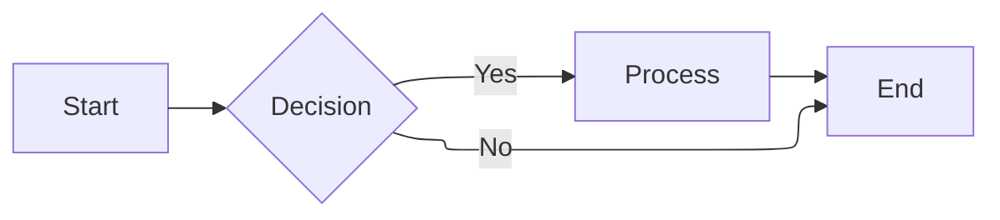

Эта страница демонстрирует возможности, доступные в этом сайте документации на Mintlify.

Лучше всего просмотреть исходный raw-код этой страницы на GitHub, чтобы увидеть, как написаны материалы.

## Форматирование текста

**жирный**, *курсив*, ~~зачёркнутый~~, `inline code`.

Верхний индекс: обычный<sup>TM</sup>, нижний индекс: обычный<sub>прим</sub>.

## Ссылки

[Внутренняя ссылка](./guide-to-editing-docs)
[Внешняя ссылка](https://spacestation14.com)

## Цитаты

> Это цитата.
>
> Второй абзац цитаты.

## Callouts

<Note>Общая информация и примечания.</Note>
<Info>Дополнительный контекст или справочная информация.</Info>
<Tip>Полезные советы и хитрости.</Tip>
<Warning title="Внимание">Следите за потенциальными проблемами.</Warning>
<Danger title="Важно">Критическая информация, требующая внимания.</Danger>
<Check>Успешные результаты и подтверждения.</Check>

<Callout icon="key" color="#FFC107" iconType="regular">Произвольный callout с иконкой и цветом</Callout>

## Badge

<Badge>Обычный</Badge>
<Badge color="green">Успех</Badge>
<Badge color="orange" size="lg" shape="pill">Beta</Badge>
<Badge icon="star" color="blue">Избранное</Badge>
<Badge stroke color="purple">Контурный</Badge>

## Accordion

<Accordion title="Нажмите, чтобы развернуть">
  Скрытое содержимое, которое можно раскрыть по запросу.

  ```csharp
  Console.WriteLine("Изнутри аккордеона");
  ```
</Accordion>

<AccordionGroup>
  <Accordion title="Раздел 1" defaultOpen>
    Контент раздела 1.
  </Accordion>
  <Accordion title="Раздел 2" icon="bot">
    Контент раздела 2.
  </Accordion>
</AccordionGroup>

## Cards

<Card title="Карточка с иконкой" icon="book" href="./guide-to-editing-docs">
  Описание карточки. Нажмите, чтобы перейти.
</Card>

<Card title="Горизонтальная карточка" icon="rocket" horizontal>
  Компактный вариант.
</Card>

<Card title="Image card" img="https://mintlify-assets.b-cdn.net/yosemite.jpg">
  Карточка с изображением.
</Card>

## Columns

<Columns cols={2}>
  <Card title="Колонка 1" icon="panel-left-close">
    Контент первой колонки.
  </Card>
  <Card title="Колонка 2" icon="panel-right-close">
    Контент второй колонки.
  </Card>
</Columns>

<Columns cols={3}>
  <Column>
    **Колонка A**

    Текст в левой колонке.
  </Column>
  <Column>
    **Колонка B**

    Текст в центральной колонке.
  </Column>
  <Column>
    **Колонка C**

    Текст в правой колонке.
  </Column>
</Columns>

## Блоки кода

```csharp
public sealed class GreeterSystem : EntitySystem
{
    public void GreetEveryone(string message)
    {
        Logger.Info(message);
    }
}
```

С подсветкой строк:

```csharp highlight={1,3-5}
public sealed class GreeterSystem : EntitySystem
{
    public void GreetEveryone(string message)
    {
        Logger.Info(message);
    }
}
```

С номерами строк и заголовком:

```csharp GreeterSystem.cs lines
public sealed class GreeterSystem : EntitySystem
{
    public void GreetEveryone(string message)
    {
        Logger.Info(message);
    }
}
```

Сворачиваемый:

```csharp expandable
public sealed class GreeterSystem : EntitySystem
{
    public void GreetEveryone(string message)
    {
        Logger.Info(message);
    }

    public void GreetEveryoneDelayed(string message, TimeSpan delay)
    {
        // Очень длинная implementation...
        // Которая может быть свёрнута
        // Для экономии места на странице
    }
}
```

Дифф:

```csharp lines
public void OldMethod() // [!code --]
public void NewMethod() // [!code ++]
{
    Logger.Info("Hello!"); // [!code ++]
}
```

### CodeGroup

<CodeGroup>
  ```csharp Greeter.cs
  Console.WriteLine("Hello!");
  ```
  ```python greeter.py
  print("Hello!")
  ```
  ```yaml greeter.yml
  - type: Greeter
    message: "Hello!"
  ```
</CodeGroup>

## Таблицы

| Свойство | Тип       | Описание                    |
| -------- | --------- | --------------------------- |
| Name     | `string`  | Имя пользователя            |
| Age      | `int`     | Возраст                     |
| Joined   | `bool`    | Подтверждение регистрации   |

С выравниванием:

| По левому краю | По центру | По правому краю |
| :------------- | :-------: | --------------: |
| значение       | значение  |         значение |

## Списки

1. Первый пункт
2. Второй пункт
   - Вложенный пункт
   - Ещё один
3. Третий пункт

## Steps

<Steps>
  <Step title="Установка">
    Установите Mintlify CLI.
  </Step>
  <Step title="Запуск">
    Запустите dev-сервер.
  </Step>
  <Step title="Проверка">
    Откройте браузер.
  </Step>
</Steps>

## Tabs

<Tabs>
  <Tab title="Windows">
    Инструкция для Windows.
  </Tab>
  <Tab title="Linux" icon="linux">
    Инструкция для Linux.
  </Tab>
  <Tab title="macOS">
    Инструкция для macOS.
  </Tab>
</Tabs>

## Tiles

<Tile href="./guide-to-editing-docs" title="Редактирование" description="Как вносить правки">
  
  
</Tile>

## Tooltip

<Tooltip tip="SS14 — Space Station 14, многопользовательская sandbox-игра" headline="SS14" cta="Узнать больше" href="https://spacestation14.com">SS14</Tooltip> — это бесплатная игра с открытым исходным кодом.

## Tree

<Tree>
  <Tree.Folder name="Content" defaultOpen>
    <Tree.File name="Server.cs" />
    <Tree.Folder name="Client">
      <Tree.File name="Program.cs" />
    </Tree.Folder>
  </Tree.Folder>
  <Tree.Folder name="RobustToolbox">
    <Tree.File name="Robust.sln" />
  </Tree.Folder>
  <Tree.File name="README.md" />
</Tree>

## Frame

<Frame caption="Yosemite National Park">
  
</Frame>

## Иконки

<Icon icon="flag" size={32} /> <Icon icon="star" color="#FFD700" /> <Icon icon="rocket" color="#FF5733" size={28} />

## Математические выражения

Блочный LaTeX:

$$ \mu = \frac{1}{N} \sum_{i=0} x_i $$

Строчный LaTeX: $ \LaTeX $

## Mermaid



С ELK-рендерингом:



## Visibility

<Visibility for="humans">
  <Note>Этот текст виден только в браузере.</Note>
</Visibility>

<Visibility for="agents">
  > Этот текст виден только AI-агентам в Markdown-экспорте.
</Visibility>

## Разделитель

---

## Комментарий (не отображается)

{/* Этот текст не попадёт в готовую страницу */}
