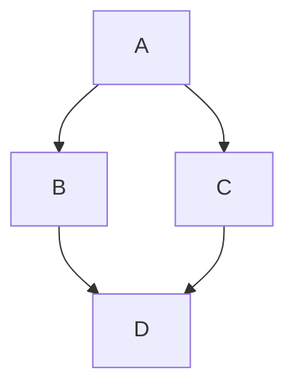

Эта страница демонстрирует возможности, доступные в этом сайте документации на Mintlify.

Лучше всего просмотреть исходный raw-код этой страницы на GitHub, чтобы увидеть, как написаны материалы.

## Markdown

Лучше всего обратиться к [общему руководству по markdown](https://www.markdownguide.org/getting-started/)!

**жирный**

*курсив*

~~зачёркнутый~~

## Выноски (Callouts)

Mintlify предоставляет несколько компонентов выносок:

<Note>
  Общая информация и примечания.
</Note>

<Info>
  Дополнительный контекст или справочная информация.
</Info>

<Tip>
  Полезные советы и хитрости.
</Tip>

<Warning title="Внимание">
  Следите за потенциальными проблемами.
</Warning>

<Danger title="Важно">
  Критическая информация, требующая внимания.
</Danger>

<Success>
  Успешные результаты и подтверждения.
</Success>

## Аккордеоны

<Accordion title="Нажмите, чтобы развернуть">
  Скрытое содержимое, которое можно раскрыть по запросу.
</Accordion>

## Блоки кода

```csharp
public sealed class GreeterSystem : EntitySystem
{
    public void GreetEveryone(string message)
    {
        Logger.Info(message);
    }
}
```

## LaTeX

Блочный LaTeX:

$$ \mu = \frac{1}{N} \sum_{i=0} x_i $$

Строчный LaTeX: $ \LaTeX $

## Mermaid


