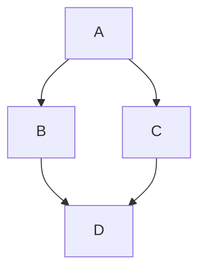
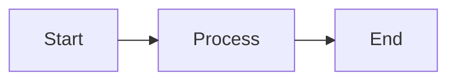

Привет! Как вы, возможно, заметили, этот сайт документации полностью открыт и доступен для редактирования на GitHub. Вы можете найти страницу этого сайта на GitHub по адресу [https://github.com/space-sorcerers/docs](https://github.com/space-sorcerers/docs).

Есть несколько моментов, которые стоит учитывать при участии. Хотя мы запрещаем web-edit PR (сделанные исключительно на GitHub) в основные репозитории Space Station 14 и Robust Toolbox, здесь это не так. **Web-редактирование приветствуется**, чтобы сделать редактирование документации максимально безболезненным.

Если вы хотите узнать, какие возможности доступны при написании документации, перейдите на [Пример страницы документации](./docs-example-page).

## Стиль

Документация должна быть написана в [стиле технической коммуникации](https://ohiostate.pressbooks.pub/feptechcomm/chapter/3-writing-style/). Эффективная техническая коммуникация должна быть [краткой, точной, прямой и хорошо организованной](https://ohiostate.pressbooks.pub/feptechcomm/chapter/3-writing-style/), написана соответствующим [голосом и тоном](https://ohiostate.pressbooks.pub/feptechcomm/chapter/3-1-voice-tone/) с использованием [правильной грамматики и пунктуации](https://ohiostate.pressbooks.pub/feptechcomm/chapter/3-2-mechanics-grammar/), со ссылками на соответствующие источники при необходимости.

## Быстрые правки через GitHub

Если вы хотите просто внести небольшую правку в страницу, выполните следующие шаги — вам не понадобится ничего из описанного далее:

1. Создайте аккаунт на GitHub или войдите, если он уже есть.
2. Сделайте fork репозитория [space-sorcerers/docs](https://github.com/space-sorcerers/docs) на GitHub.


3. Нажмите на иконку «View & Edit Page on GitHub» в правом верхнем углу любой страницы этого сайта.


4. Нажмите кнопку «Edit this file» в правом верхнем углу просмотра файла.


5. Внесите изменения, затем сделайте commit и создайте pull request! Мы сделаем всё остальное.

## Локальная сборка

### Установка

Требуется Node.js v20.17.0 или новее.

Установите CLI Mintlify глобально:

```bash
npm i -g mint
```

### Запуск dev-сервера

Из корня проекта:

```bash
mint dev
```

Откроется локальный предпросмотр по адресу `http://localhost:3000` с горячей перезагрузкой при изменении файлов.

### Проверка на ошибки

```bash
npx mintlify validate
```

Проверяет синтаксис всех `.mdx` файлов и навигацию. Запускается в CI при каждом PR.

### Обновление CLI

```bash
mint update
```

### Форматирование

Для подсветки синтаксиса и форматирования MDX-файлов используйте расширения:

- **VS Code / Cursor**: [MDX](https://marketplace.visualstudio.com/items?itemName=unifiedjs.vscode-mdx) + [Prettier](https://marketplace.visualstudio.com/items?itemName=esbenp.prettier-vscode)

## Проверка изменений

Если вы создали PR, проще всего проверить изменения во вкладке «Files changed» в GitHub. Также можно использовать локальное расширение для предпросмотра markdown, например, для [VSCode](https://marketplace.visualstudio.com/items?itemName=shd101wyy.markdown-preview-enhanced).

Для аутентичного предпросмотра каждый PR будет автоматически развёрнут через Mintlify preview. Ссылку можно найти в разделе проверок PR.

## Ревью

Мейнтейнеры будут проверять pull request для документации на содержание и [стиль](#style). Мейнтейнеры понимают, что многие участники не являются носителями языка, и будут полезны в своих комментариях к ревью.

Чтобы максимально эффективно использовать время мейнтейнеров, перед отправкой, пожалуйста:

- Вычитайте свои изменения
- Используйте проверку орфографии
- Рассмотрите использование инструментов проверки грамматики, таких как [Grammarly](https://www.grammarly.com/)

## Синтаксис MDX

Мы используем **MDX** — Markdown с возможностью встраивать JSX-компоненты. Ниже — основные конструкции.

### Заголовки

```mdx
## Заголовок секции
### Подзаголовок
#### Подподзаголовок
```

#### Пользовательские ID

```mdx
## Моя секция {#custom-anchor}
```

Ссылка: `#custom-anchor`.

#### Отключение привязки

```mdx
<h2 noAnchor>
Заголовок без якоря
</h2>
```

### Форматирование текста

| Стиль           | Синтаксис        | Результат           |
| --------------- | ---------------- | ------------------- |
| **Жирный**      | `**текст**`      | **жирный текст**    |
| *Курсив*        | `_текст_`        | *курсив*            |
| ~~Зачёркнутый~~ | `~текст~`        | ~~зачёркнутый~~     |
| Верхний индекс  | `<sup>текст</sup>` | обычный<sup>верхний</sup> |
| Нижний индекс   | `<sub>текст</sub>` | обычный<sub>нижний</sub> |

### Ссылки

```mdx
[Внутренняя страница](/ru/meta/guide-to-editing-docs)
[Внешний ресурс](https://example.com)
```

### Блочные цитаты

```mdx
> Это цитата.
>
> Второй абзац цитаты.
```

### Разделители

```mdx
---
```

### Переносы строк

```mdx
Строка до.<br />
Строка после.
```

### Комментарии MDX

```mdx
{/* Это комментарий — он не попадёт в собранную страницу */}
```

<Warning>
HTML-комментарии `<!-- -->` в MDX не работают. Используйте `{/* */}`.
</Warning>

### Экранирование специальных символов

В MDX фигурные скобки (`{}`) и угловые скобки (`<>`) имеют специальное значение. Чтобы вывести их как обычный текст, оберните в обратные кавычки или используйте HTML-сущности:

```mdx
Синтаксис `{variable}` для подстановки значений.
Стрелочка `->` — это не JSX.
```

### Математические выражения

Строчные: `$E = mc^2$`

Блочные:
```mdx
$$
E = mc^2
$$
```

## Таблицы

```mdx
| Свойство | Тип     | Описание          |
| -------- | ------- | ----------------- |
| Name     | `string`| Имя пользователя  |
| Age      | `int`   | Возраст           |
```

Выравнивание столбцов:

```mdx
| По левую | По центру | По правую |
| :------- | :-------: | --------: |
| left     |  center   |     right |
```

## Списки

```mdx
1. Первый пункт
2. Второй пункт
   - Вложенный пункт
   - Ещё вложенный
3. Третий пункт
```

## Изображения

```mdx

```

С тёмной/светлой темой:

```html


```

## Блоки кода

### Обычный блок

````mdx
```csharp
public sealed class GreeterSystem : EntitySystem
{
    public void GreetEveryone(string message)
    {
        Logger.Info(message);
    }
}
```
````

### С заголовком

````mdx
```csharp GreeterSystem.cs
public void GreetEveryone(string message)
```
````

### С иконкой

````mdx
```yaml icon=file-yaml
- type: Greeter
  message: "Hello!"
```
````

### Подсветка строк

````mdx
```csharp highlight={1,3-5}
public sealed class GreeterSystem : EntitySystem
{
    public void GreetEveryone(string message)
    {
        Logger.Info(message);
    }
}
```
````

### Фокус на строках

````mdx
```csharp focus={2,4}
public sealed class GreeterSystem : EntitySystem
{
    public void GreetEveryone(string message)
    {
        Logger.Info(message);
    }
}
```
````

### Номера строк

````mdx
```csharp lines
public void GreetEveryone(string message)
{
    Logger.Info(message);
}
```
````

### Сворачиваемый блок

````mdx
```csharp expandable
// Длинный код, который можно свернуть
Console.WriteLine("Hello!");
```
````

### Перенос строк

````mdx
```csharp wrap
var message = "This is a very long line of code that will wrap to the next line instead of scrolling horizontally.";
```
````

### Дифф (различия)

````mdx
```csharp lines
public void OldMethod() // [!code --]
public void NewMethod() // [!code ++]
```
````

### Группы кода (CodeGroup)

Синхронизируются по заголовкам с другими CodeGroup и Tabs на странице:

````mdx
<CodeGroup>
```csharp Greeter.cs
Console.WriteLine("Hello!");
```
```python greeter.py
print("Hello!")
```
```bash greeter.sh
echo "Hello!"
```
</CodeGroup>
````

Для выпадающего списка вместо вкладок:

```mdx
<CodeGroup dropdown>
  ...
</CodeGroup>
```

## Компоненты Mintlify

### Callouts

```mdx
<Note>   Примечание   </Note>
<Info>   Информация   </Info>
<Tip>    Совет        </Tip>
<Warning>Предупреждение</Warning>
<Danger> Опасность     </Danger>
<Check>  Готово        </Check>
```

Кастомный:

```mdx
<Callout icon="key" color="#FFC107">Произвольный callout</Callout>
```

### Accordion

```mdx
<Accordion title="Заголовок">
  Скрытое содержимое.
</Accordion>
```

Группа:

```mdx
<AccordionGroup>
  <Accordion title="Раздел 1">...</Accordion>
  <Accordion title="Раздел 2" icon="bot">...</Accordion>
</AccordionGroup>
```

### Badge

```mdx
<Badge>Обычный</Badge>
<Badge color="green" size="sm">Готово</Badge>
<Badge color="orange" size="lg" shape="pill">Beta</Badge>
<Badge icon="star" color="blue">Избранное</Badge>
```

### Cards

```mdx
<Card title="Заголовок" icon="book" href="/ru/page">
  Описание карточки.
</Card>

<Card title="Горизонтальная" icon="rocket" horizontal>
  Компактный вариант.
</Card>
```

### Columns

```mdx
<Columns cols={2}>
  <Card title="Колонка 1">...</Card>
  <Card title="Колонка 2">...</Card>
</Columns>
```

### Frame (для изображений)

```mdx
<Frame caption="Подпись под изображением">
  
</Frame>
```

### Icons

```mdx
<Icon icon="flag" size={32} />
<Icon icon="star" color="#FFD700" />
```

### Steps

```mdx
<Steps>
  <Step title="Шаг 1">
    Инструкция для первого шага.
  </Step>
  <Step title="Шаг 2">
    Инструкция для второго шага.
  </Step>
</Steps>
```

### Tabs

```mdx
<Tabs>
  <Tab title="Windows">
    Инструкция для Windows.
  </Tab>
  <Tab title="Linux" icon="linux">
    Инструкция для Linux.
  </Tab>
</Tabs>
```

Вкладки с одинаковыми названиями синхронизируются по всей странице.

### Tiles

```mdx
<Tile href="/page" title="Заголовок" description="Описание">
  
</Tile>
```

### Tooltip

```mdx
<Tooltip tip="Определение термина" headline="Термин" cta="Читать далее" href="/page">
  термин
</Tooltip>
```

### Tree (файловая структура)

```mdx
<Tree>
  <Tree.Folder name="content" defaultOpen>
    <Tree.File name="index.yml" />
    <Tree.Folder name="maps">
      <Tree.File name="station.yml" />
    </Tree.Folder>
  </Tree.Folder>
  <Tree.File name="meta.json" />
</Tree>
```

### Mermaid (диаграммы)

````mdx

````

С ELK-рендерингом:

````mdx

````

### Visibility (показывать разный контент людям и AI)

```mdx
<Visibility for="humans">
  Видно только в браузере.
</Visibility>

<Visibility for="agents">
  Видно только AI-агентам в Markdown-экспорте.
</Visibility>
```

## Переиспользуемые сниппеты

Создайте файл в `/snippets/` и импортируйте его на любую страницу:

```mdx
import SetupGuide from "/snippets/setup-guide.mdx";

<SetupGuide />
```

С переменными:

```mdx
import InstallSnippet from "/snippets/install.mdx";

<InstallSnippet packageName="MyMod" />
```

## Frontmatter (YAML-шапка)

Каждый `.mdx` файл начинается с `---`:

```yaml
---
title: "Название страницы"
description: "Описание для поисковиков и превью"
sidebar_position: 5
---

```

Полезные поля:

| Поле           | Описание                            |
| -------------- | ----------------------------------- |
| `title`        | Заголовок страницы                  |
| `description`  | Описание (SEO, превью)             |
| `sidebar_position` | Порядок в боковой панели        |
| `noindex`      | `true` — скрыть от поисковиков      |
| `canonical`    | Канонический URL                    |
| `og:title`     | Свой заголовок для соцсетей         |
| `og:image`     | Своя картинка для превью            |
| `boost`        | Приоритет в поиске (1.0 = обычный)  |
| `groups`       | Доступно только указанным группам   |
| `draft`        | `true` — черновик, не публикуется   |

## SEO и мета-теги

Глобальные мета-теги задаются в `docs.json`:

```json
"seo": {
  "metatags": {
    "og:image": "https://docs.ss14.art/images/og.png",
    "google-site-verification": "..."
  }
}
```

### Канонические URL

```json
"seo": {
  "metatags": {
    "canonical": "https://docs.ss14.art"
  }
}
```

### OG-изображения

По умолчанию Mintlify генерирует OG-картинку автоматически. Можно задать фоновое изображение:

```json
"thumbnails": {
  "background": "/images/og-background.png"
}
```

### Карта сайта и robots.txt

Mintlify генерирует `sitemap.xml` и `robots.txt` автоматически. Чтобы добавить свой `robots.txt`, создайте файл `robots.txt` в корне проекта.

### Content-Signal (AI-индексация)

Mintlify добавляет в `robots.txt` директивы Content-Signal:

```
Content-Signal: ai-train=yes, search=yes, ai-input=yes
```

## Редиректы

При перемещении страниц настройте редиректы в `docs.json`:

```json
"redirects": [
  {
    "source": "/old/path",
    "destination": "/new/path"
  }
]
```

С wildcard:

```json
"redirects": [
  {
    "source": "/ru/:slug*",
    "destination": "/en/:slug*"
  }
]
```

## Поиск

### Boost (приоритет страницы)

В frontmatter страницы:

```yaml
---
boost: 3
---
```

Или для целой группы в `docs.json`:

```json
{
  "group": "Getting started",
  "boost": 5,
  "pages": ["quickstart", "concepts"]
}
```

### Максимум результатов

Настраивается в дашборде Mintlify: Settings → Deployment → Search → Maximum search results.

## Изменение docs.json

<Warning>
Не меняйте `docs.json` без явной необходимости. Это конфигурация всего сайта: навигация, редиректы, темы, SEO.
</Warning>

Основные секции `docs.json`:

- `navigation` — структура боковой панели и локализация
- `redirects` — редиректы
- `seo` — мета-теги и поисковая оптимизация
- `colors` — цвета темы
- `styling.codeblocks` — темы подсветки кода
- `banner` — баннер в верхней части сайта
