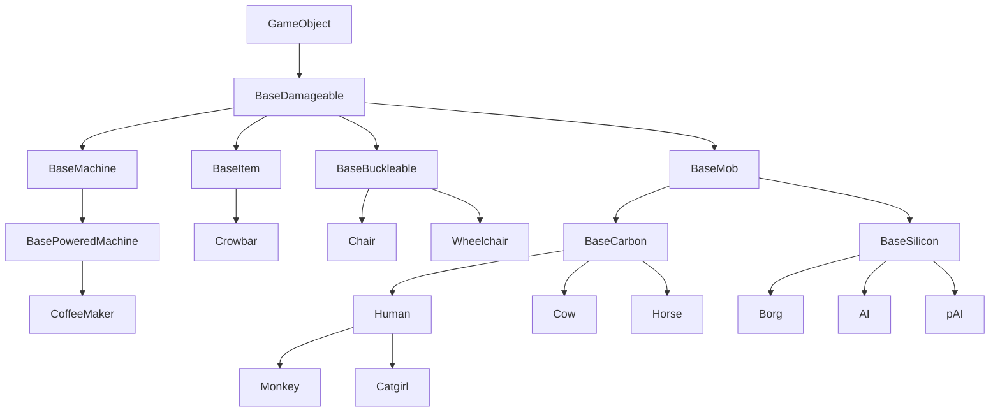
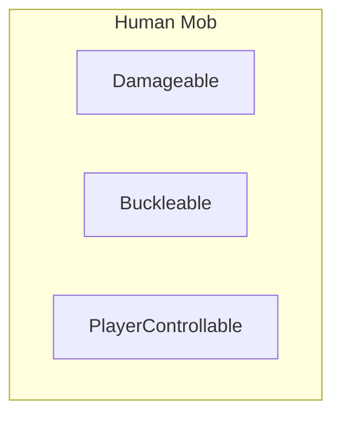
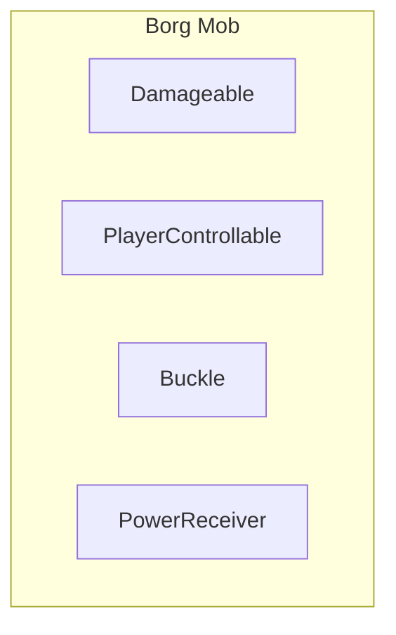
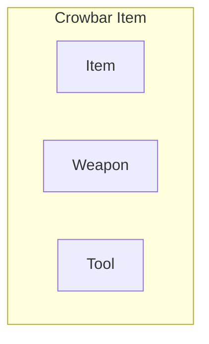
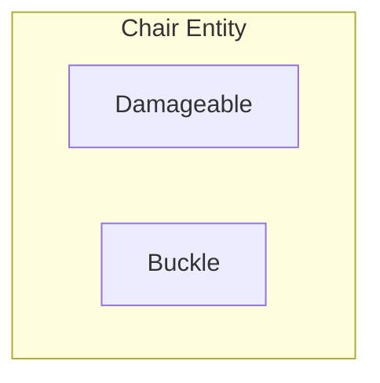
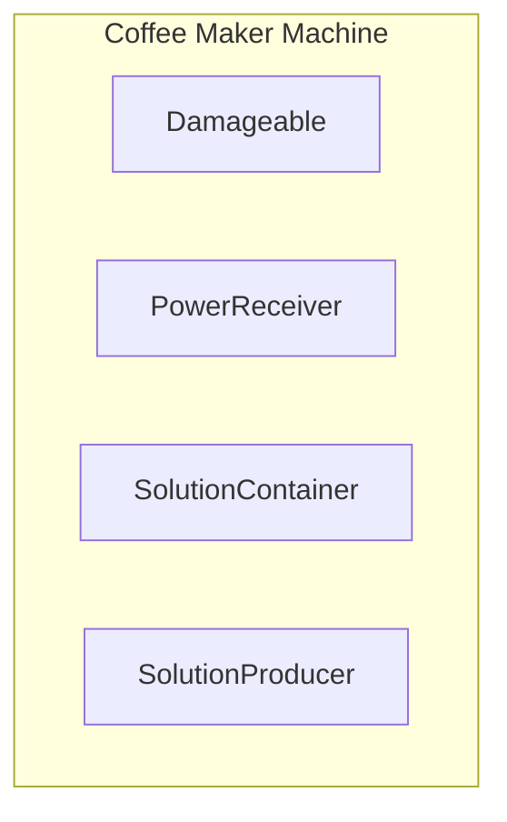

Встройте это куда-нибудь красиво.

https://youtu.be/W3aieHjyNvw

https://youtu.be/JxI3Eu5DPwE

## Решение проблемы «OOP — это плохо»: ECS

Итак, группировка ECS ([Entity Component System](https://en.wikipedia.org/wiki/Entity_component_system)) наконец-то убедила вас, что OOP — это плохо, а ECS — хорошо, да?
Отлично! OOP действительно плох. В этом документе мы рассмотрим некоторые основные концепции, такие как компоненты, Entity System и события, а также изучим подход ECS к ним.

<Info>
Для наглядного, реального примера ECS в действии в нашей кодовой базе взгляните на [Stacks](https://github.com/space-wizards-federation/space-station-14/pull/4046) и [Actors](https://github.com/space-wizards-federation/RobustToolbox/pull/1774).
</Info>

## Почему композиция предпочтительнее наследования для игровых объектов?
Когда вы думаете о том, как спроектировать игровые объекты, такие как люди, предметы или стены, вашей первой мыслью может быть использование сложных деревьев наследования:



Выглядит нормально, правда?
Однако, по мере добавления всё новых и новых функций, вы быстро осознаете ограничения такого подхода. Давайте рассмотрим некоторые проблемы, с которыми вы можете столкнуться.

1. Допустим, вы хотите, чтобы борги, но не AI и не pAI, потребляли энергию из энергосети, как `BasePoweredMachine`.
Что делать? Сделать наследование боргов от `BasePoweredMachine`?
Это невозможно, так как им нужно наследовать и от `BaseMob`, и от `BaseSilicon`.
Может, сделать `BaseMob` наследником `BasePoweredMachine`?
Это тоже не имеет смысла — большинству мобов не понадобится такая функциональность.
Единственный вариант — дублировать код, отвечающий за питание, между `BaseMachinePowered` и `Borg`.
2. Допустим, вы хотите разрешить пристёгиваться к лошадям и боргам, но не к остальным мобам.
Что делать, сделать `BaseMob` наследником `BaseBuckleable`?
Это не имеет смысла — большинству мобов не понадобится такая функциональность.
Ваш единственный вариант снова — дублировать код в нескольких отдалённых классах.

Как мы видим, сложные деревья наследования — не идеальное решение, и в конечном итоге они вынуждают нас без необходимости дублировать код или наделять определённые игровые объекты функциональностью, которая им никогда не понадобится.
Решение всех этих проблем — использовать **композицию**.











Как видите, использование композиции аккуратно решает все наши предыдущие проблемы без дублирования кода и обеспечивает лучшую поддерживаемость и расширяемость:
- Борги и кофеварки используют компонент `PowerReceiver`, что позволяет им потреблять энергию из сети.
- Борги и стулья используют компонент `Buckle`, что позволяет сущностям с `Buckleable` (например, людям) пристёгиваться к ним.
- Люди и борги используют компонент `PlayerControllable` (также известный как `Mind` в коде SS14), который позволяет игроку управлять ими...
- И большинство игровых объектов выше используют `Damageable`, что даёт им «здоровье» и возможность получать урон.

TODO: закончить
----

Отредактировать весь этот текст во что-то подходящее для документа... Вздох

Итак, обычно мы подразумеваем несколько вещей под «OOP плох», и я не уверен, как уместить всё это в простое объяснение, но вот моя попытка.
1. Во-первых, наследование. Есть множество проблем и негибкости, связанных со сложными деревьями наследования... Представьте, что у нас нет компонентов, а есть огромное дерево наследования: если у вас есть базовый класс «machine» с потреблением энергии и другой базовый класс «mob» с механикой управления игроком, то сделать моба с качествами машины (или наоборот) без уродливых хаков или общего базового класса для «machine» и «mob» практически невозможно. Но в то же время это не имело бы особого смысла! Большинству мобов не нужны «функции потребления энергии», и мало какие машины будут управляться игроком... Итак, чтобы решить эту ужасную проблему, мы используем «композицию» (компоненты!) вместо наследования. Вы уже знаете это: если хотите, чтобы у сущности были руки, добавьте `HandsComponent`. Если хотите, чтобы она потребляла энергию, `PowerConsumerComponent` поможет! Если хотите сделать её управляемой игроком, добавьте `MindComponent` и управляйте сущностью — и вуаля, мы сделали «киборга» из переиспользуемых, обобщённых компонентов! Это, конечно, трудно сделать с одним лишь огромным деревом наследования... Наследование может быть хорошим для небольших вещей или когда у вас очень маленькое и самодостаточное дерево наследования (см., например, `SoundSpecifier` — оно крошечное, но наследование там очень помогает), но когда у вас большая сложная игра, такая как SS14, наследование только всё усложняет.
2. Также инкапсуляция — ещё один момент. OOP любит помещать данные и методы/логику в один и тот же класс, в виде связки, и предоставлять только определённые вещи внешнему миру. Вы знаете, забавные модификаторы доступа вроде `public`, `private` и т.д.? Инкапсуляция хороша для таких вещей, как движок, которому нужно скрывать/запрещать доступ к некоторым данным или методам. Но она не имеет особого смысла для игровых данных и логики. Например, `StackComponent` в SS14 не имеет приватных полей или свойств — любой может свободно читать и записывать значения как хочет. Однако это не рекомендуется для взаимодействия со стеками!
`StackSystem` имеет несколько методов для работы с `StackComponent` и изменения его значений. Чтобы использовать определённое количество чего-либо в стеке, вы используете `StackSystem.Use`, чтобы разделить — `StackSystem.Split` и т.д., и `StackSystem` позаботится обо всём. Потому что оказалось, что просто изменить значение количества в стеке недостаточно. Нужно также делать такие вещи, как: помечать компонент как изменённый для синхронизации по сети, устанавливать значение внешнего вида, вызывать событие `StackCountChanged` и т.д.
В архитектуре E/C вы бы поместили всю эту логику в свойство «amount» в `StackComponent` или, возможно, в метод. Затем вы могли бы сделать фактическое число «amount» приватным. Однако архитектура E/C не будет принята в этой кодовой базе — мы будем использовать только архитектуру ECS.

Понимаете, размещение любого рода логики в классе компонента не имеет никакого смысла. Если подумать о том, как устроено всё в ECS, это выглядит так:
1. Наш игровой мир содержит множество сущностей, у сущностей есть компоненты
2. Есть системы, которые работают с компонентами

Следовательно, компоненты должны содержать только данные и никакой логики. Системы должны обеспечивать поведение сущностей, когда у них есть соответствующие компоненты.
Я хочу сказать, что... Вместо того чтобы логика в компонентах меняла что-то, мы хотим, чтобы Entity System работали и изменяли компоненты. Таким образом, вместо:
`HandsComponent.Pickup(ItemComponent)`, у вас будет:
`HandsSystem.Pickup(UserEntity, ItemEntity)`.

## Компоненты: пересмотр
Ах, компоненты. Долгое время они были сердцем симуляции игры: смесь данных и логики, как миска с размокшей лапшой.
Однако, как мы убедились на собственном опыте, масштабирование такого подхода далеко от идеала.
Со временем у вас появляются компоненты, которые тесно связаны с множеством других компонентов, и всё превращается в неподдерживаемый беспорядок. Что делать, когда компонент требует, чтобы на сущности существовал другой компонент? Добавить его, если он отсутствует, или сообщить об ошибке?

Решение всего этого и многого другого — удалить ВСЮ логику из компонентов и просто рассматривать их как контейнеры для данных или маркеры. В долгосрочной перспективе это означает, что все компоненты могут быть превращены в структуры, что потенциально повысит производительность во многих областях игры.

Но подождите, если мы удалим всю логику из компонентов, как мы добавим поведение сущности?
Встречайте *Entity Systems*.

## Entity Systems: какими они должны были быть с самого начала
Entity Systems, как следует из названия, — это системы для сущностей.
Это означает, что они содержат всю логику и поведение для сущностей.

### События, подписки и методы
Entity Systems используют *подписки на события* для получения обратных вызовов при определённых действиях.
Например, вы можете подписаться на получение обратного вызова при инициализации компонента определённого типа и т.д.
Системы также могут иметь публичные методы, которые могут вызывать другие Entity System, и они могут вызывать события для передачи информации. Как правило, ваши публичные методы принимают UID сущностей, компоненты и данные в качестве аргументов.

```csharp
// Система, работающая на сервере...
// Всякий раз, когда пользователь взаимодействует с сущностью, имеющей этот компонент,
// счётчик в ней будет увеличен на ноль. Также будет вызвано событие.
// Другие Entity Systems могут взаимодействовать с FooComponent через публичный API.
public sealed class FooSystem : EntitySystem
{
    [Dependency] protected readonly SharedAppearanceSystem _appearanceSystem = default!;

    // Всегда подписывайтесь на события здесь, при инициализации
    public override void Initialize()
    {    
        // Подписка на инициализацию FooComponent...
        SubscribeLocalEvent<FooComponent, ComponentInit>(OnFooInit);
        
        // Подписка на взаимодействие пользователя с FooComponent через предмет.
        SubscribeLocalEvent<FooComponent, InteractUsingEvent>(Handle);
        
        // Подписка на широковещательное событие MoveEvent, вызываемое при
        // перемещении сущности... Просто пример подписки
        SubscribeLocalEvent<MoveEvent>(OnEntityMove);
    }
    
    // Вызывается при инициализации FooComponent.
    private void OnFooInit(Entity<FooComponent> ent, ref ComponentInit _)
    {
         // Инициализируйте ваш FooComponent здесь
    }
    
    // Пример обработчика для взаимодействия с FooComponent пользователем.
    private void Handle(Entity<FooComponent> ent, ref InteractUsingEvent args)
    {
        // Увеличиваем счётчик взаимодействий на единицу
        // Мы вызываем этот метод, так как он делает всё за нас.
        SetInteractCounter((ent, ent.Comp), ent.Comp.InteractCounter + 1);
    }
    
    // Вызывается при перемещении сущности.
    private void OnEntityMove(ref MoveEvent ev)
    {
        // Сделайте что-нибудь здесь! Хотя мы ничего не делаем, так как это пример...
    }

    // Публичный метод, который другие системы могут вызывать для взаимодействия с FooComponent
    public void ResetInteractCounter(Entity<FooComponent?> ent)
    {
        // Просто вызываем наш другой метод, который всё делает за нас.
        SetInteractCounter(ent, 0);
    }

    // Публичный метод, который другие системы могут вызывать для взаимодействия с FooComponent
    public void SetInteractCounter(Entity<FooComponent?> ent, int count)
    {
        // Пытаемся разрешить компонент...
        if (!Resolve(ent, ref ent.Comp))
            return;
    
        // Сохраняем старый счётчик для последующего использования...
        var oldCounter = ent.Comp.InteractCounter;
        
        // Устанавливаем новый счётчик взаимодействий
        ent.Comp.InteractCounter = count;
    
        // Теперь устанавливаем некоторые данные внешнего вида, если у сущности есть компонент внешнего вида
        if (TryComp(ent, out AppearanceComponent? appearance))
            _appearanceSystem.SetData(ent, FooVisualData.InteractCounter, count, appearance);
            
        // Теперь вызываем событие, чтобы дать всем знать, что InteractCounter изменился
        // Поскольку третий аргумент — false, это событие не будет широковещательным.
        // Оно будет вызвано только как направленное событие!
        RaiseLocalEvent(ent, new FooInteractCounterChangedEvent(oldCounter, ent.Comp.InteractCounter));
    }
}

[RegisterComponent]
public sealed partial class FooComponent : Component
{    
    // Это будет увеличиваться каждый раз, когда пользователь взаимодействует с нами.
    // Обратите внимание, что логика этого находится не в компоненте, а в системе.
    [DataField]
    public int InteractCounter = 0;
}

// Событие, которое будет вызываться при изменении счётчика взаимодействий FooComponent.
// Это событие неизменяемо и информативно, то есть не может быть изменено обработчиками,
// и его единственная цель — информировать о некотором событии, в данном случае об изменении значения.
public sealed class FooInteractCounterChangedEvent : EntityEventArgs
{
    public int OldCounter { get; }
    public int NewCounter { get; }
    
    public FooInteractCounterChangedEvent(int oldCounter, int newCounter)
    {
        OldCounter = oldCounter;
        NewCounter = newCounter;
    }
}

[Serializable, NetSerializable]
public enum FooVisualData
{
    InteractCounter,
}
```

### Создание и использование

Когда вы создаёте новый класс, наследующий EntitySystem, или существующую Entity System, он будет автоматически создан и использован движком при запуске игры.
По сути, это [singleton](https://gameprogrammingpatterns.com/singleton.html), то есть в любой момент времени существует только один экземпляр Entity System.

### Время жизни

Entity Systems имеют разное время жизни на сервере и клиенте:
На сервере время жизни Entity System практически равно времени работы программы.

Но на клиенте время жизни Entity System совершенно иное.
Entity Systems создаются и инициализируются при подключении к серверу и завершают работу и удаляются при отключении клиента от сервера. По этой причине вы всегда должны очень тщательно обрабатывать очистку при завершении работы Entity System на клиенте.

### Межзависимости

Entity Systems могут иметь зависимости от других Entity System, используя атрибут `[Dependency]`, так же как и с менеджерами IoC. Это предпочтительнее, чем получать другие Entity System вручную и кешировать их в поле вашей системы или получать их на лету в методах.
Стоит отметить, что вы можете иметь зависимости только от Entity System в Entity System.
Пример:

```csharp
public sealed class BarSystem : EntitySystem
{
    public void Doo()
    {
        // Некоторая логика здесь
    }
    
    public void Hicky()
    {
        // Некоторая логика здесь
    }
}

public sealed class FooSystem : EntitySystem
{
    // Это будет автоматически установлено при создании системы.
    [Dependency] private readonly BarSystem _barSystem = default!;
 
     // Обычные зависимости от менеджеров IoC также работают здесь
    [Dependency] private readonly IPlayerManager _playerManager = default!;
 
    public override void Initialize()
    {
        // Это работает в Initialize, зависимости уже разрешены.
        _barSystem.Doo();
    }
    
    public void MyFunnyMethod()
    {
        _barSystem.Hicky();
    }
}

```

## События, или как создать сложную игру без спагетти-кода
События позволяют Entity System общаться между собой без явной связывания.

Есть два способа вызвать (и подписаться на) событие в RobustToolbox: направленные события и широковещательные события.

### Направленные события
Направленные события вызываются для конкретной сущности, и если какие-либо подписки на события соответствуют событию и одному из компонентов сущности, они будут вызваны. Порядок обратных вызовов может быть явно указан при подписке на направленное событие, если необходимо (см. «Сортированные события»).
Такой тип событий обычно предпочтительнее; они гораздо более производительны и позволяют вызывать события на этапах жизненного цикла компонента (см. ниже).

### Широковещательные события
Широковещательные события вызываются без привязки к какой-либо конкретной сущности (если только сам экземпляр события не указывает её! Но даже в этом случае оно всё равно не является полностью «направленным»).
Entity Systems подписываются на эти события и получают обратный вызов при каждом их вызове.

### Примечание: Сортированные события
Как направленные, так и широковещательные подписки на события могут указывать порядок обработки.
Точнее, они могут указывать, какие типы (Entity Systems) будут обрабатывать событие до и после подписывающейся Entity System.

Если массивы «before» и «after» равны null, сортировка при обработке события для данной Entity System учитываться не будет.
Сортированные подписки на события используют более медленный путь, поэтому используйте их только при крайней необходимости.

## Шаблоны событий

Теперь, когда мы знаем, как вызывать события, давайте рассмотрим несколько различных шаблонов кода и «типов» событий, которые вы можете встретить при работе с событиями! Имейте в виду, что некоторые события могут сочетать некоторые из этих шаблонов или не следовать им на 100%. Будьте креативны при создании событий!

### Неизменяемые события
Эти события неизменяемы — то есть вы не можете изменять их содержимое.

#### Событие жизненного цикла
Этот тип событий очень особенный: вы не можете создавать новые без модификации движка, и они всегда направленные.
Они информируют подписчика о событии жизненного цикла компонента.
- **ComponentAdd** — компонент был добавлен к сущности.
- **ComponentInit** — компонент был инициализирован.
- **ComponentStartup** — компонент был запущен.
- **ComponentShutdown** — компонент был остановлен.
- **ComponentRemove** — компонент будет удалён.

#### Информационное событие
Этот тип событий информирует подписчика о том, что что-то произошло.
Например: событие, вызываемое при закреплении сущности игроком, событие, вызываемое при смерти моба...

### Изменяемые события
Эти события могут иметь как неизменяемые, так и изменяемые поля.
Entity Systems и обработчики могут свободно изменять изменяемые поля для передачи информации инициатору события, такой как результат действия, специальные данные и т.д.

#### Отменяемое событие
Также известны как «Attempt events».
Эти события обычно вызываются, чтобы позволить другим Entity System отменить какое-либо действие.
Например, когда игрок закрепляет машину, вы можете захотеть вызвать событие попытки закрепления, которое другие Entity System могут отменить, если тайл занят, моб игрока неспособен к закреплению и т.д. В таких событиях обычно есть изменяемое поле «Cancelled», которое может быть установлено в true Entity System для отмены действия или события. Другие Entity System могут отменить отмену, но обычно этого делать не стоит.

Вы можете использовать наследование от `CancellableEntityEventArgs`.

#### Обработанное событие
Эти события предназначены для обработки одной Entity System. У них есть изменяемое поле «Handled», которое показывает, было ли оно уже обработано. Другим Entity System необходимо взаимодействовать и обрабатывать их только в том случае, если они ещё не были обработаны. Вариант *method event* ниже.

Вы можете использовать наследование от `HandledEntityEventArgs`.

#### Обеспечивающее событие
Это событие, по сути, является *обработанным событием*, единственное отличие — в том, как Entity Systems с ним работают. Этот тип событий позволяет выполнить операцию над сущностью, *гарантируя*, что у неё будет определённый компонент. Если его нет, он будет добавлен Entity System, обрабатывающей его.
Этот шаблон работает путём вызова обработанного события, как направленного, так и широковещательного.
Это работает, потому что направленные события всегда вызываются до широковещательных.

Направленная подписка всегда помечает событие как обработанное и выполняет некоторую операцию.
Широковещательная подписка, в той же Entity System, ничего не делает, если событие уже обработано. Если же оно не было обработано, то добавляет компонент к сущности и вручную вызывает направленный обработчик для выполнения операции.

#### Method event

**НЕ ИСПОЛЬЗУЙТЕ ЭТО, ЕСЛИ НЕ ПОНИМАЕТЕ, ЧТО ДЕЛАЕТЕ.**
99.9% случаев вам нужно использовать методы Entity System вместо этого.

Этот тип событий может иметь поля «input» (неизменяемые, устанавливаются инициатором события), поля «output» (изменяемые, устанавливаются обработчиком события) и поля «input/output» (изменяемые, могут устанавливаться как инициатором, так и получателями).

Например, разделение стека использует (*больше не используется после бунта против method event в 2021 году*) (направленное) событие с количеством в качестве входного поля и nullable сущностью для вновь созданного разделённого стека в качестве выходного поля.
Однако широковещательные события, следующие этому шаблону, также очень полезны: чтобы создать сущность стека определённого типа, вы можете вызвать широковещательное событие с типом стека на входе и получить сущность на выходе.

Этот тип событий идеален для определённых сложных случаев, когда несколько Entity System могут захотеть выполнить логику при возникновении события, подобно обычным вызовам методов. Это позволяет Entity System общаться между собой без какого-либо связывания, сохраняя модульность и расширяемость так, как это никогда не позволила бы логика компонентов. Если вам нужно расширить функциональность, вы почти всегда можете сделать это без изменения существующего кода, перехватывая события или просто подписываясь на них.

### События с ручной сортировкой

Иногда вам просто нужно иметь возможность сортировать подписки на события по нескольким приоритетам...
~~Но, учитывая, что добавление этого в базовую систему направленных событий невозможно, мы можем создать систему приоритетов самостоятельно для нашего события.~~ Оказывается, после написания этого была добавлена настоящая система сортировки событий. Как вам такое? Вероятно, вам стоит использовать её вместо этого, если вы не знаете, что делаете.

Для этого вместо одного события мы создаём два или более события.

- BeforeDooHickyEvent
- DooHickyEvent
- AfterDooHickyEvent

Как следует из названий, они вызываются по порядку, создавая аккуратную систему приоритетов.
Вы даже можете комбинировать этот шаблон с шаблоном *обработанного события*, чтобы прекратить вызов событий следующего приоритета, если предыдущее уже было обработано.

## Рекомендации по созданию событий
- Имена классов событий всегда должны заканчиваться на «Event», никогда на «Message» или что-то ещё.
- Если ваше событие связано с сущностью и является широковещательным, оно должно иметь свойство/поле, ссылающееся на сущность, чтобы широковещательные подписки могли правильно использовать событие. `RaiseLocalEvent()` не делает событие широковещательным по умолчанию, если явно не указать параметр `broadcast` как `true` при его вызове.
- Входные параметры события всегда должны устанавливаться в конструкторе. Опциональные входные параметры тоже — используйте для них необязательные аргументы.
- Документируйте ваш класс события должным образом. Пишите, что он делает или что он должен представлять. Если свойство предназначено для входного и/или выходного параметра, укажите это в комментарии.

## Часто задаваемые вопросы по ECS
**В**: В чём разница между E/C и ECS?
**О**: Архитектура E/C была популяризирована в 2003 году движком Unity. ECS+Events — лучшая архитектура, чем E/C в стиле Unity. В E/C используются сообщения компонентов, что подразумевает размещение логики в компонентах. ECS — это специфический дизайн, оптимизированный для параллелизма и дружественности к кешу. ECS понижает статус сущностей — от наличия собственного кода до простого набора компонентов — и делает то же самое с компонентами, перекладывая всю работу на системы. Идея в том, что система может быть оптимизирована для выполнения своей работы массово параллельным образом, и сами системы могут выполняться параллельно с разрешением зависимостей.

**В**: Почему компоненты не используют инкапсуляцию? (т.е. private-члены.)
**О**: Прежде всего, компоненты не могут использовать инкапсуляцию, потому что тогда в них была бы логика, что противоречит принципам ECS, которым мы следуем. Инкапсуляция не имеет смысла, когда компоненты являются простыми контейнерами данных, так как в них нет логики. Кроме того, если цель инкапсуляции — предотвратить прямое изменение членов компонента разработчиками вместо использования конкретных Entity System, есть лучшие способы это предотвратить: документирование/комментирование кода, ревью PR и использование новых атрибутов `Friend`.

**В**: Почему интерфейсы в компонентах были заменены системами и событиями?
**О**: Использование интерфейсов имело очень низкую производительность; события и системы значительно быстрее, а также более мощные и поддерживаемые. Кроме того, использование интерфейсов в компонентах означало, что они должны содержать логику, что нарушает один из наших основных принципов ECS.

**В**: А сущность — это коллекция компонентов с идентификатором?
**О**: Идеальная сущность — это просто идентификатор, а её компоненты хранятся в другом месте, эффективно. Смысл в дизайне, ориентированном на данные. Идентификатор — это просто индекс в нескольких массивах, каждый из которых содержит только один тип компонента, в наиболее производительных реализациях. В компонентах нет кода, поведения, ничего — только поля данных. Системы должны обеспечивать поведение/логику.

**В**: То есть компоненты действуют как теги?
**О**: Да. Компоненты — это хранилища данных, по сути теги с настраиваемыми данными. Entity Systems работают с компонентами и их данными.

**В**: То есть системы просто ищут компоненты на сущностях?
**О**: И да, и нет. Идеальная система вообще не знает о сущности, она знает только компоненты, с которыми работает.

**В**: А когда нужно взаимодействие между двумя компонентами, что смотрит на оба компонента и понимает: «ой, им нужно работать вместе»?
**О**: #1 Лучше вообще избегать таких отношений.
#2 У вас есть третья система (так, у вас есть A и ASystem, B и BSystem, вы создаёте ABSystem, которая получает список кортежей (A,B) для работы). Например, система рендеринга игрока может потребовать доступа к 3-4 компонентам, но это допустимо для её случая использования (например, в roguelike).

**В**: Что делает `RaiseLocalEvent`?
**О**: Он вызывает событие локально (в отличие от сетевого). Есть две перегрузки. Одна принимает только событие и вызывает его как широковещательное. А другая принимает `EntityUid` и событие для вызова его как направленного на сущность, и имеет опциональный параметр для также широковещательного вызова.
