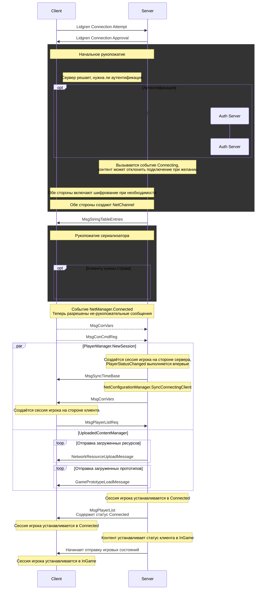

Это полная последовательность шагов, которые выполняются при подключении клиента в RobustToolbox (и, в некоторой степени, в Space Station 14). Это невероятно запутанная система, которая развивалась в течение нескольких лет и имеет множество движущихся частей и состояний. Уф.

## Базовый обзор

