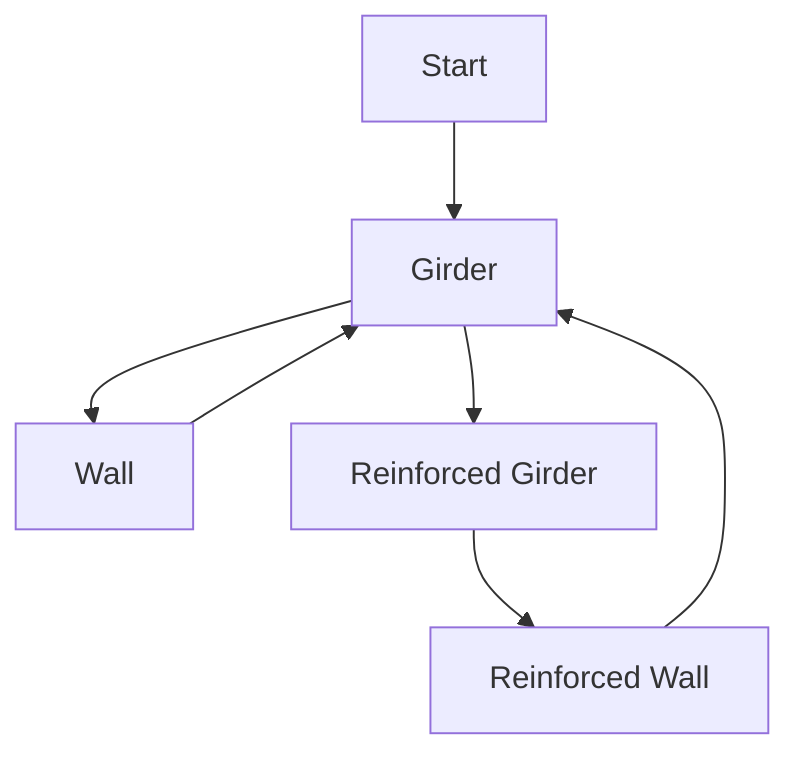

- Мощная
- Ориентированная на данные
- Управляемая событиями
- Тьюринг-полная
- Одобрено PJB[^1]
- Основана на теории графов и AI Pathfinding
- Написана тем же нёрдом, который принёс вам atmos и botany :^)

## TODO Индекс

- Введение в Construction Graphs
	- Объяснение концепции графов, узлов, рёбер и шагов.
- Написание и Проектирование Construction Graphs
  - Объяснение того, как писать и проектировать хороший граф.
- Список шагов, действий и условий.
- Написание начальных конструкций.
  - Объяснение ограничений.
- Как Добавить Пользовательские Шаги
- Внутреннее Устройство Системы Construction
  - Общий обзор того, как construction работает внутри.

## Граф конструкции

Эта система строительства основана на убеждении, что любая сложная конструкция в игре может быть определена как [граф](https://en.wikipedia.org/wiki/Graph_theory) взаимосвязанных состояний, или **узлов**. Цель этой системы — облегчить проектирование и создание новых сложных взаимодействий (конструкций) между сущностями, радикально сокращая объём кода, необходимого для их реализации.

Графы состоят из **узлов** и связей между ними, называемых **рёбрами**.

**Граф конструкции 'Girder'**



---
### Узлы

Узлы представляют текущее состояние сущности.
Сущность, имеющая граф конструкции, всегда будет находиться в одном из узлов и может перемещаться между ними при определённых обстоятельствах, определяемых рёбрами.

#### Узлы и прототипы сущностей
Узлы могут указывать ID прототипа сущности. Сущность, прибывшая в узел, который указывает прототип, отличный от её текущего, будет удалена, а указанный прототип сущности будет создан на её месте. Когда это происходит, все контейнеры, принадлежащие `ConstructionComponent` сущности, будут перенесены в новую сущность.

<Info>
Указанный прототип сущности ОБЯЗАТЕЛЬНО должен иметь `ConstructionComponent` с правильным графом и узлом.
</Info>

#### Действия
Вы можете указать действия, которые будут выполнены при прибытии сущности в узел (независимо от того, прибыла ли она по ребру или была создана, уже находясь в узле).
Чтобы создать новое, нужно просто создать C# класс, реализующий `IGraphAction`.
Действия могут делать что угодно: от создания другого прототипа до удаления самой сущности.

---
### Рёбра
Рёбра — это связи или переходы между узлами. Они определяют взаимодействия, необходимые для перехода сущности из одного узла в другой.
#### Завершённые действия
Вы можете указать действия, которые будут выполнены после завершения ребра, непосредственно перед тем, как сущность достигнет нового узла. Используются те же классы, что и для действий узлов, через `IGraphAction`. Вы можете создавать новые, реализуя этот интерфейс в новом C# классе.
#### Условия
Вы также можете указать условия, которые должны быть выполнены, чтобы ребро стало доступным. Все они будут проверены до начала и во время прохождения ребра. Вы можете создавать пользовательские действия, создав новый C# класс, реализующий `IEdgeCondition`.
#### Шаги
Шаги — это взаимодействия, необходимые для перехода сущности из одного узла в другой по ребру.
Ребро может указывать столько шагов, сколько требуется.
##### Tool step
Этот шаг требует использования инструмента с правильным качеством (quality) на сущности.
##### Material step
Этот шаг требует вставки произвольного количества материала в сущность.
    Он работает *разделением* стопок материалов.
##### Component step
Этот шаг требует вставки сущности с определённым компонентом.
    Использование этого шага не запрещается, но в большинстве случаев рекомендуется использовать теги.
##### Tag step
Этот шаг требует вставки сущности с определённым тегом.
##### Multiple Tags step
Этот шаг требует вставки сущности с набором тегов, указанных в `allTags` и `anyTags`. `allTags` действует как `И`, а `anyTags` — как `ИЛИ`. Вы сможете вставлять только те сущности, которые удовлетворяют обоим требованиям. Вы можете указать только одно из двух или оба сразу.
#### Контейнеры
Любой шаг, требующий от пользователя внесения предмета в конструкцию (material, prototype и component шаги), может сохранить внесённый предмет в именованный контейнер на сущности. Когда сущность изменяется при достижении узла с другим прототипом сущности, все эти контейнеры *будут перенесены в новую сущность*. Система construction позволяет использовать этот сохранённый предмет для любых целей, таких как извлечение данных из компонента сохранённого предмета для различных эффектов (см. граф конструкции компьютера) или просто для того, чтобы 'сохранить' и позже вернуть тот же самый предмет, который внёс пользователь.

---
### Прототип графа конструкции

Ниже вы найдёте пример графа конструкции с документацией для обучения написанию графов.
Примеры из реального мира смотрите в прототипах графов в коде игры.

```yaml
- type: constructionGraph

  # Идентификатор графа.
  id: ExampleGraph
  
  # Графы должны указывать начальный узел для целей поиска пути.
  # Все остальные узлы должны быть достижимы из этого.
  start: start
  
  # А теперь определяем сам граф!
  graph:
  
    # Узлы определяются так.
    - node: start
    
      # Прототип сущности, указанный этим узлом.
      # Это превратит сущность в него, если он отличается.
      entity: MySpecialEntity
    
      # Узлы могут иметь действия, выполняемые при достижении узла.
      # Они выполняются в том же порядке, в котором определены, сверху вниз.
      actions:
        # Действия без параметров указываются так.
        # Тип — это имя C# класса, реализующего IGraphAction.
        - !type:ExampleActionWithNoParameters {}
        
        # Действия могут указывать любые параметры, поскольку реализуют IExposeData.
        - !type:ExampleActionWithParameters
          foo: "bar"
          
        # Ниже приведены все допустимые действия на момент написания.
        
        # Это действие просто воспроизводит звук от сущности с вариацией высоты тона.
        - !type:PlaySound
          sound: /path/to/my/sound.ogg
          # Когда указана soundCollection, 'sound' игнорируется.
          soundCollection: mySoundCollection
          
          # Это действие отображает всплывающее сообщение пользователю.
        - !type:PopupUser
          # Показывается ли сообщение на курсоре или на сущности.
          cursor: false
          text: "Привет, человек, который заставил меня достичь этого узла!"
          
          # Устанавливает значение anchor сущности.
        - !type:SetAnchor
          value: true
          
          # Привязывает сущность к плитке, на которой она стоит.
        - !type:SnapToGrid
          offset: Center # или Edge. Смотрите enum SnapGridOffset.
          
          # Создаёт прототип сущности на местоположении сущности.
        - !type:SpawnPrototype
          # ID прототипа сущности. В данном случае, один стальной лист.
          prototype: SteelSheet1
          # Количество созданий
          amount: 5
          
          # Изменяет спрайт сущности.
        - !type:SpriteChange
          # Слой для изменения. По умолчанию ноль.
          layer: 0
          # Спецификатор спрайта RSI+State.
          specifier:
            sprite: "My/special/sprite.rsi"
            state: "sample_state"
          # Спецификатор текстуры. Продублирован только для обучения.
          specifier: "My/texture/somewhere.png"
          
          # Изменяет состояние RSI слоя.
        - !type:SpriteStateChange
          # Слой для изменения. По умолчанию ноль.
          layer: 0
          state: "my_state"
          
          # Устанавливает данные визуализатора в int.
        - !type:VisualizerDataInt
          # Ключ (обычная строка или enum) данных.
          key: "enum.MyVisualizerVisuals.MyVisuals"
          # Устанавливаемые данные.
          data: 1
        
          # Специальное действие для создания компьютера из компьютерной платы
          # в определённом контейнере. Вероятно, вы не захотите это использовать.
        - !type:BuildComputer
          # Контейнер, где находится компьютерная плата.
          container: "board"
          
          # Удаляет сущность! Действия после этого не выполняются.
        - !type:DeleteEntity {}
      
      # А теперь определяем рёбра!
      edges:
        # Это определяет ребро. 'otherNode' — идентификатор другого узла.
        - to: otherNode
          # Здесь также принимаются действия, как выше.
          # Они будут выполнены после завершения ребра.
          completed:
            - !type:ExampleActionWithNoParameters {}
            
          # Рёбра также могут указывать условия.
          # Все они должны быть выполнены, чтобы ребро было доступно.
          # Они определяются аналогично действиям выше.
          conditions:
            - !type:ExampleConditionWithNoParameters {}
            
            # Ниже приведены все условия на момент написания.
          
              # Условие для наличия сущности с компонентом на плитке,
              # или отсутствия сущностей с определённым компонентом на плитке.
            - !type:ComponentInTile
              # Имя компонента.
              component: "myComponent"
              # Если true, любая сущность на плитке должна иметь компонент.
              # Если false, на плитке не должно быть сущностей с компонентом.
              hasEntity: true
              
              # Условие для пустого контейнера на сущности.
            - !type:ContainerEmpty
              container: "board"
              
              # Условие для необходимости закреплённости или откреплённости сущности.
            - !type:EntityAnchored
              # Требуемое состояние anchored для выполнения условия.
              anchored: false
              
              # Условие для открытой/закрытой панели проводов сущности.
            - !type:WirePanel
              # Состояние панели проводов для выполнения условия.
              open: true
    
      # А теперь определяем фактические шаги этого ребра.
      steps:
      
      
        # Material step. Требует вставки материала.
      - material: Glass # Любой из StackType.
        amount: 2
        # Если указан store, материал будет сохранён в контейнере.
        # Если store не указан, он будет просто удалён.
        store: myContainer
        # Все шаги могут иметь задержку do_after, в секундах.
        doAfter: 2
        # Все шаги также могут иметь завершённые действия, как и рёбра.
        # Они указываются так же, как и действия узлов.
        # Они будут выполнены после завершения шага (после doAfter)
        completed:
        - !type:ExampleActionWithNoParameters {}
        
        
        # Tool step. Требует использования инструмента на сущности.
      - tool: Screwing # Как указано в enum ToolQuality.
        doAfter: 0.25
        
        
        # Component step.
      - component: ComputerBoard # Принимает любые сущности с этим компонентом.
        # Контейнер, где будет храниться предмет.
        # Он будет удалён, если это не указано.
        store: board
        # Это имя будет использоваться в руководстве по строительству.
        name: Компьютерная плата
        # Эта иконка будет использоваться в руководстве по строительству.
        # Использует SpriteSpecifier.
        icon: /Textures/My/Path/To/A/Texture.png
        
        
        # Prototype step. Требует вставки сущности из
        # определённого прототипа. Больше ничего не примет.
      - prototype: MyVerySpecificPrototype
        # Контейнер, где будет храниться предмет.
        # Он будет удалён, если это не указано.
        store: aCertainContainer
        # Это имя будет использоваться в руководстве по строительству.
        name: Определённый Предмет
        # Эта иконка будет использоваться в руководстве по строительству.
        # Использует SpriteSpecifier.
        icon:
          sprite: My/Path/To/A/Sprite.rsi
          state: MyState
      
      
        # Tag step. Требует вставки сущности с определённым тегом.
        # Больше ничего не примет.
      - tag: MyVerySpecificTag
        # Контейнер, где будет храниться предмет.
        # Он будет удалён, если это не указано.
        store: anotherCertainContainer
        # Это имя будет использоваться в руководстве по строительству.
        name: Другой Определённый Предмет
        # Эта иконка будет использоваться в руководстве по строительству.
        # Использует SpriteSpecifier.
        icon: /Textures/I/Cant/Thing/Of/Anything.png
        
        
        # Multiple tag step. Позволяет требовать определённую конфигурацию тегов.
        
        # Я напишу несколько допустимых конфигураций multiple tag step.
        # Имейте в виду, что multiple tag step также может указывать
        # 'store', 'name', 'icon' и 'doAfter'! Я опущу их здесь
        # для большей ясности...
        
        # Это потребует, чтобы сущность имела все теги ниже.
      - allTags:
          - MyTagOne
          - MyTagTwo
          
        # Это потребует, чтобы сущность имела любой из тегов ниже.
      - anyTags:
          - MyTagOne
          - MyTagTwo
          
        # Это потребует, чтобы сущность имела MyTagOne и либо
        # MyTagTwo, либо MyTagThree.
      - allTags:
          - MyTagOne
        anyTags:
          - MyTagTwo
          - MyTagThree
          
        # Это потребует, чтобы сущность имела MyTagOne и MyTagFour
        # и либо MyTagTwo, либо MyTagThree.
        # Как видите, порядок может быть любым!
      - anyTags:
          - MyTagTwo
          - MyTagThree
        allTags:
          - MyTagOne
          - MyTagFour
    
    # Мы можем продолжать определять столько узлов, сколько захотим... Небо — это предел!
    - node: otherNode
    - node: anotherNode    
```

**TODO**: Где-нибудь перечислить и объяснить все действия/условия графа.

## Прототип рецепта конструкции

Для указания рецептов конструирования/крафта в меню строительства нужно написать прототипы construction.

```yaml
# Girder
- type: construction

  # Понятное пользователю имя.
  name: girder
  
  # Идентификатор рецепта.
  id: girder
  
  # Идентификатор графа конструкции.
  graph: girder
  
  # Узел, с которого мы начинаем рецепт. (Состояние призрака конструкции)
  startNode: start
  
  # Узел, которого мы пытаемся достичь. Может быть любым узлом в графе,
  # если от начального узла до него есть путь.
  targetNode: girder
  
  # Понятная пользователю категория рецепта.
  category: Structures
  
  # Понятное пользователю описание, показанное в меню.
  description: Большая структурная сборка из металла.
  
  # Спецификатор спрайта для рецепта. Показывается в меню.
  icon:
    sprite: /Textures/Constructible/Structures/Walls/solid.rsi
    state: wall_girder

  # Является ли это Структурой или Предметом.
  # В случае структуры будет размещён призрак конструкции.
  # Затем пользователю нужно взаимодействовать с ним, чтобы начать строительство.
  # В случае предмета пользователь пытается скрафтить предмет напрямую из
  # предметов в руках, инвентаре и окружении.
  objectType: Structure
  
  # Режим размещения.
  placementMode: SnapgridCenter
  
  # Те же условия, что и для рёбер, но они будут проверены перед конструированием.
  conditions:
    - !type:ExampleConstrutionConditionWithNoParameters {}
    
    # Ниже приведены все текущие construction условия на момент написания.
    
    # Проверяет, есть ли низкая стена на плитке. Полезно для окон.
    - !type:LowWallInTile {}
    
    # Проверяет, нет ли окон на плитке. Полезно для низких стен.
    - !type:NoWindowsInTile {}
```

#### Начальная конструкция
Что происходит, когда вы пытаетесь скрафтить предмет или начать строительство призрака конструкции?
Система construction попытается найти путь от начального узла к целевому узлу.
Этот первый шаг в конструировании очень особенный. У него есть некоторые ограничения, которых нет у обычных рёбер.
Например, tool steps не разрешены, а условия рёбер не проверяются. По этой причине вы должны проектировать свой начальный узел так, чтобы он имел чёткие, простые рёбра без этих запрещённых функций. Завершённые действия шагов и рёбер, однако, разрешены. Все они будут выполнены одновременно при успешном конструировании.

**TODO**: Перенести это в объяснение меню строительства.

#### Construction условия
Construction условия должны быть C# классами в проекте Shared content.
Они реализуют `IConstructionCondition`.

**TODO**: Перечислить все текущие construction условия.

## Меню строительства

**TODO**: Перенести объяснение прототипа construction сюда.

**TODO**: Объяснить узел 'start' и использовать пример графа стеклянного листа.

### Призраки конструкции

**TODO**: Объяснить начальную конструкцию должным образом.

### Крафт

**TODO**: Объяснить, как работают графы крафта предметов.

[^1]: PJB действительно вонючий.
