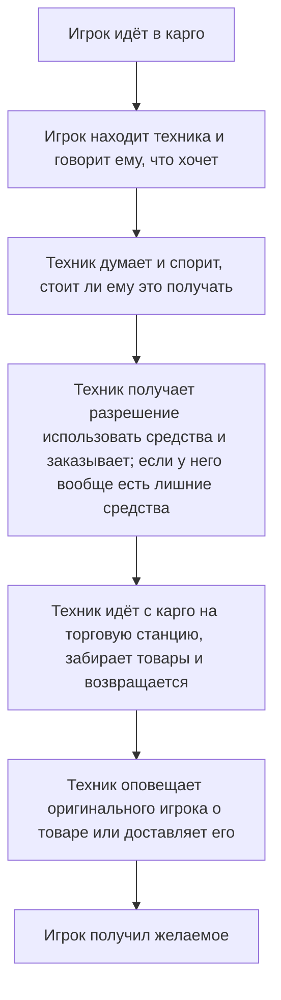
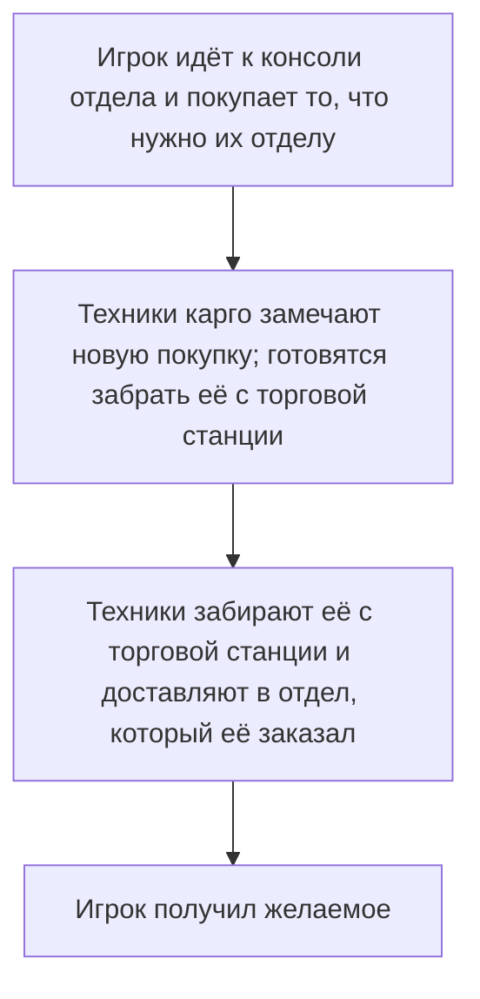

| Дизайнеры | Реализовано | GitHub |
|---|---|---|
| mirrorcult | :x: Нет | TBD |

Цель этого предложения — создать систему экономических взаимодействий в игре, которая добавит геймплей, увеличит самостоятельность игроков и отделов, а также создаст новые возможности взаимодействия игроков. Вместо того чтобы быть втиснутой ради самой себя (ворчим-ворчим), представленная здесь реализация экономики решает реально существующие проблемы дизайна интуитивными способами, освобождая, а не ограничивая дизайнерское пространство в своих взаимодействиях.

## Немного предыстории

Я здесь, чтобы убедить вас, что в текущем рабочем процессе карго существует проблема трения, (в основном) независимо от таких вещей, как время в пути торговой станции / шаттла. Текущий игровой процесс для игрока, который хочет что-то, выглядит примерно так:

Каждый шаг создаёт некоторое потенциальное трение, задержку, возможность некомпетентности или неудачи и т. д. Это не обязательно плохо, но этого трения достаточно, чтобы люди либо просто не заморачивались, либо (справедливо) злились, когда не могут что-то сделать из-за того, что находится вне их контроля.

## Проблемы

Есть несколько ключевых моментов, на которых стоит сосредоточиться:
- Карго выступает в роли посредника на нескольких разных этапах (запрос, покупка и доставка), хотя это не намного интереснее, чем если бы они были посредником в одной точке.
- То, что карго приходится тратить свои собственные деньги на покупки для других, означает, что стимулы плохо согласованы с результатом, который мы на самом деле хотим (люди получают то, что просят) — опять же, не обязательно фундаментальная проблема, но это создаёт серьёзное трение.
- Поскольку практически каждый шаг, кроме просьб, изолирован в карго, игроки в отделах чувствуют, что у них очень мало контроля, когда дело доходит до принятия решений о том, как приобрести необходимые припасы.

## Решения

Мы рассмотрим несколько концепций, которые я хотел бы внедрить для экономической системы, а затем вернёмся к тому, как это повлияет на общий процесс для отдела, желающего себя обеспечить.

### Средства отделов

**Средства отделов** разбивают текущий единый «банковский счёт станции» на отдельные счета для каждого отдела. Карго, конечно, получает свой собственный счёт, но так же поступают *сервис*, *наука*, *медицина*, *охрана* и *инженерия*. Последствия этого обсуждаются далее.

### Децентрализованные закупки

Каждый отдел с собственным банковским счётом теперь имеет *свой собственный* терминал закупок карго в своём отделе. Члены отдела могут выбирать, что заказать, и о покупках объявляется в радиоканале отдела, а также в канале карго. Покупки производятся за счёт средств отдела, который их заказал, поэтому они не зависят от решений других отделов.

Это не «запрос» в карго — когда покупка совершена, деньги списываются со счёта отдела, и заказ появится на торговой станции. Теперь работа карго заключается в управлении этими заказами и их правильной доставке, а не в приёме заказов и решении за всех, что покупать.

Карго, конечно, по-прежнему разрешено покупать вещи для себя, если они хотят повеселиться.

#### Продажа по отделам с сейф-боксами

Конечно, возникает вопрос, как продажа вписывается во всю эту историю. Есть несколько способов решить это, но тот, который я предлагаю, — дать каждому отделу набор *сейф-боксов* в начале раунда — неразрушимых контейнеров, которые просто запираются и отпираются с помощью доступа отдела — которые, будучи доставленными в карго и в конечном итоге проданными, отдают 75% прибыли соответствующему отделу и 25% карго, чтобы стимулировать их фактически продавать то, что им дают.

Когда карго продаёт что-то (не в сейф-боксе), 75% идёт карго, а 25% распределяется между другими отделами так же, как распределяется финансирование. Идеальный переход к следующему разделу!

### Финансирование исследований NT и распределение

Поскольку деньги теперь будут более актуальны для всех, а продажа не является жизнеспособным источником дохода для многих отделов (таких как медицина или инженерия), я решил включить альтернативный источник денег, который очень хорошо интегрируется с игрой, имеет забавные лор-импликации и по-прежнему сосредоточен на взаимодействии игроков.

Этот источник — **финансирование исследований NanoTrasen**. Станция существует не просто так — якобы это *исследовательская* станция, и она не может выполнять свою работу без финансирования! «Исследование» здесь относится не конкретно к отделу, а к тому, для чего станция существует в первую очередь. В моей концепции цель станции — исследовать, насколько хорошо экипаж может справляться с интенсивным давлением, а также с опасностями окружающей среды и внутренними угрозами. **Чем больше «исследований» проводится** (т. е. насколько опасна станция), **тем больше финансирования выделяется**. Доведите станцию до предела.

Каждые 10-15 минут (или другой произвольный интервал, вы поняли) NT будет оценивать, насколько опасна станция, на основе некоторых метрик, включая:
- Мёртвые / раненые члены экипажа
- Разрушенные машины / отсутствие питания
- Количество угроз (аномалии, враждебные мобы и т. д.)

Чем опаснее станция, тем больше финансирования выделяется, вместе с текстом, поздравляющим станцию или порицающим её, если выделено недостаточно. Если вызван аварийный шаттл, финансирование *приостанавливается* до тех пор, пока шаттл не будет отозван, так как это рассматривается как завершение экипажем «эксперимента». Если аварийный шаттл вызван ниже определённого уровня опасности или слишком рано, NanoTrasen может заставить вас заплатить в качестве компенсации.

Как определяется, куда идёт финансирование? Справедливый вопрос! В этой системе глава персонала получит новую **консоль распределения финансирования** в своём кабинете, которую можно использовать для определения процента, который каждый отдел получает от каждой вливания средств (а также от продажи товаров карго, упомянутой выше). Она будет начинаться с разумного разделения по умолчанию (с некоторыми лёгкими вариациями, или реже сильными вариациями) на случай, если HoP нет (или он никогда не удосуживается его изменить), которое выглядит следующим образом:

- Медицина: **30%**
- Инженерия: **25%**
- Охрана: **20%**
- Наука: **15%**
- Сервис: **10%**
- Карго: **0%** — ожидается, что карго будет зарабатывать деньги старым добрым предпринимательством.

Ожидается, что HoP будет изменять распределение со временем, когда станет ясно, какие отделы нуждаются в финансировании больше всего, или просто отдавать всё тому, кто меньше всех достаёт. Само собой разумеется, что эта консоль просто ограничена доступом и может быть изменена любым, кто вломится, хотя HoP является её естественным владельцем. Конечно, любые изменения легко отменить, если их заметить, так как они применяются только при фактическом поступлении финансирования или продаж. Эта система — и кнут, и пряник: наука хорошо работает? Дайте им бонус! Наука спамит морбами и отказывается их убирать? Деньги достанутся сервису и клоуну, которые, вероятно, используют их лучше.

Когда поступает новый раунд финансирования и объявляется всем, распределение и точное количество средств, выделенных каждому отделу, также отображается.

### Переводы и выкачивание

Любая хорошая экономика нуждается в способе движения средств. Эта система работает лучше всего, когда она оставляет как можно больше на усмотрение игроков — это, в конечном счёте, заставляет экономику работать в реальной жизни. Система финансирования и продажи обходят эту дизайнерскую точку, поскольку в любом случае нужен какой-то конечный источник и сток с тем, как сейчас работает игра, но всё остальное должно происходить между реальными игроками. С точки зрения дизайна, переводы должны быть относительно простыми и доступными для игроков, чтобы они приносили пользу и было весело с ними взаимодействовать.

Используя ту же консоль, которая используется для покупки товаров отдела через карго, игроки могут вставить свою ID-карту и выбрать сумму для перевода в другой отдел. С ID главы отделения переводы не ограничены. С обычным ID отдела вы можете перевести не более ~20%(?) текущих средств с перезарядкой. Сумма и переводчик объявляются обоим отделам. Предполагается, что игроки будут заключать сделки в чаре от имени своих персонажей и использовать переводы в качестве оплаты за услуги или товары. Например:

- Инженерия может попросить у карго некоторое финансирование, и если QM решает удовлетворить запрос, он переводит им дополнительные средства.
- Медицина обещает оплату сервису, если ботаника может произвести для них определённый химикат.
- Охране требуется медицинская помощь ОЧЕНЬ быстро, и она обещает большие деньги, если медицина бросит свои неважные дела и поможет.

Что касается **выкачивания**, идея заключается в том, что консоль в хранилище сможет свободно снимать средства со счетов отделов в виде реальных бумажных спесо — с некоторой задержкой и объявлением для ограбления. Спесо можно вставлять в любую соответствующую консоль закупок отдела/карго.

## Заключение

При целостной реализации изложенных здесь систем я вижу много преимуществ. Деньги всегда интересны игрокам — им нравится чувствовать, что они получают большую прибыль или заключают тёмные сделки, так что интеграция этого со всеми — хорошо. Игроки отделов будут иметь гораздо больше самостоятельности и должны чувствовать себя гораздо менее разочарованными из-за того, что некоторые вещи «требуют» карго, поскольку трение для получения чего-либо из карго значительно уменьшается. Игроки карго должны чувствовать себя гораздо менее напряжённо, сохраняя при этом весёлые части своей работы и новое измерение, связанное с управлением входящими покупками, о которых их не всегда явно уведомляли. С точки зрения дизайна, мы можем проектировать вокруг продаж, покупок и заключения сделок между отделами, не чувствуя, что мы приговариваем игроков к бесконечным страданиям без вариантов, если карго некомпетентно или медленно. Я ожидаю некоторого забавного рольплея и взаимодействий вокруг перевода средств между отделами, а также отделов, умоляющих HoP о большем финансировании для их любимых проектов.

Возвращаясь к примеру рабочего процесса карго ранее, вот как я представляю его реализацию:

Для наших целей — гораздо лучше!

Некоторые вещи, о которых придётся подумать при реализации этой системы:
- Цены карго почти наверняка придётся перебалансировать, так как карго теперь имеет гораздо больше самостоятельности заказывать что угодно, не влияя на остальную станцию (так как у них будут свои средства).
- Задания (bounties), вероятно, нужно будет децентрализовать, чтобы отделы могли видеть больше выгоды для себя.
- В целом нужно будет ввести больше ящиков карго, так как будет больше предложения и больше заказов. Некоторые ящики, вероятно, придётся удалить.
- Карго потребуется больше геймплея, сосредоточенного на доставке — некоторые забавные механики доставки, такие как MULE или тележки, были бы очень кстати.
- Вероятно, мы захотим уменьшить количество некоторых вещей на станции в целом и ожидать, что отделы будут заказывать вещи, если им нужно больше, а не давать им больше как костыль для карго из-за слишком большого трения.

## Возможные будущие расширения

Это в основном то, о чём я думал поверхностно, но не прорабатывал в уме и не хочу расширять рамки.

- Спекулятивные рынки — акции, процедурно генерируемые крипто-шиткоины и т. д. ПРОДОЛЖАЙТЕ ИГРАТЬ
- Отдельные торговые станции для разных рынков — тёмный рынок, где могут быть синдикаты; подпольный рынок, принимающий только крипто-шиткоины; поставщик продуктов, продающий только оптом; и тому подобное.
- Кредиты, которые отделы могут брать — не сможете выплатить кредит вовремя, наёмники придут переломать колени вашему отделу.
- Бессовестно украсть PTL у goonstation — это просто очень хорошо и круто. [Поищите](https://wiki.ss13.co/Power_Transmission_Laser)
- Пользовательские вендоры из Eris для отделов, чтобы зарабатывать деньги, продавая вещи напрямую другим отделам, делая переводы ещё проще.
